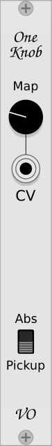

# VO Modules
Modules for [VCV Rack](https://github.com/VCVRack/Rack)

----

## OneKnob
  
Allow controlling the last touched parameter by midi controller.  
Map the knob to CC message with MIDI-MAP module or connect CV output of MIDI-CC module to CV input.  
Click on the parameter you want to control.  
Module can work in absolute and pickup modes.  
Abs mode - As soon as the physical control is moved, its new value is sent immediately to the last touched parameter.  
PickUp mode - Moving the physical control has no effect until it reaches the value of its destination parameter.  

